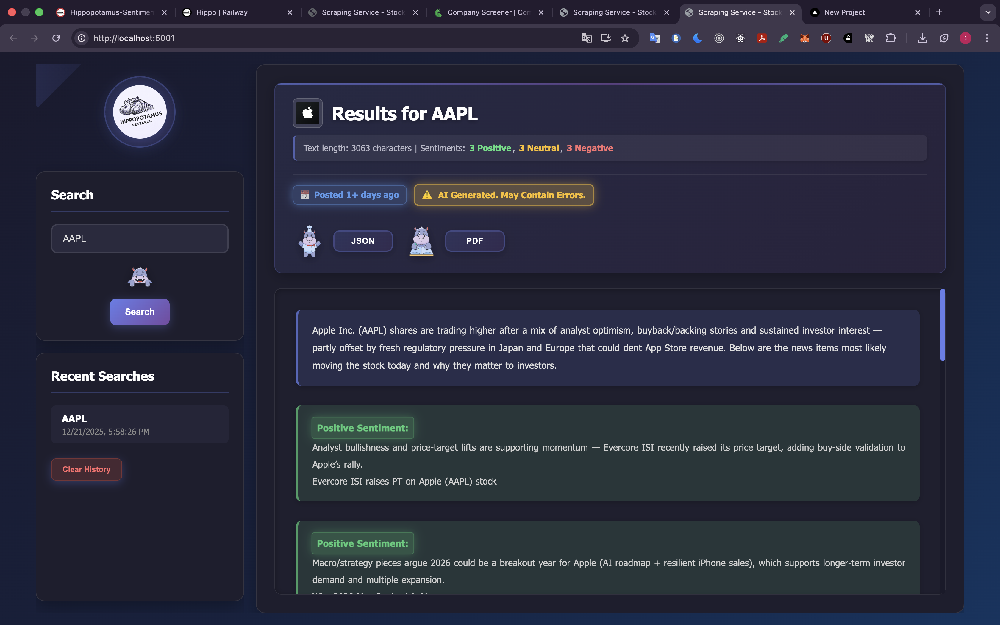
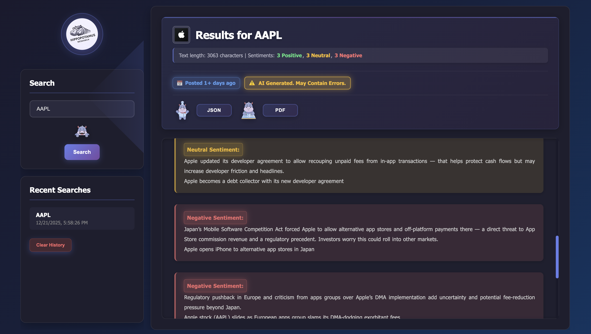
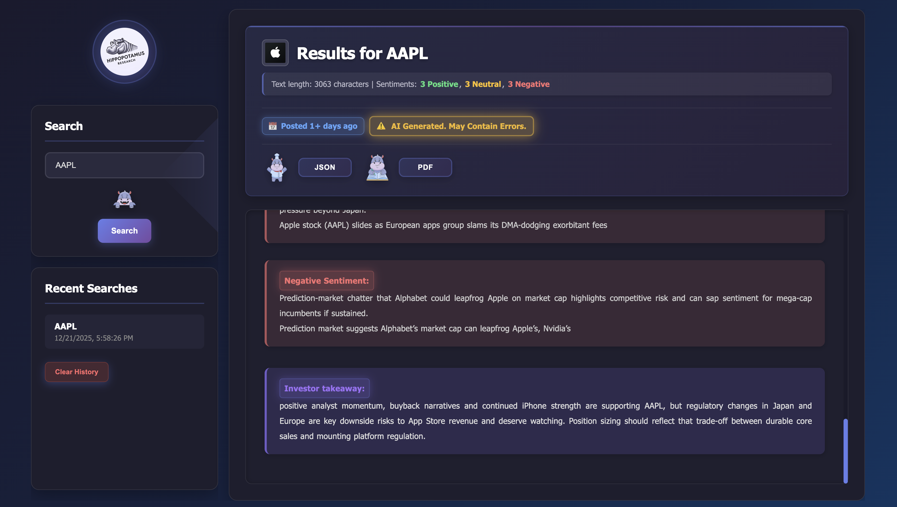
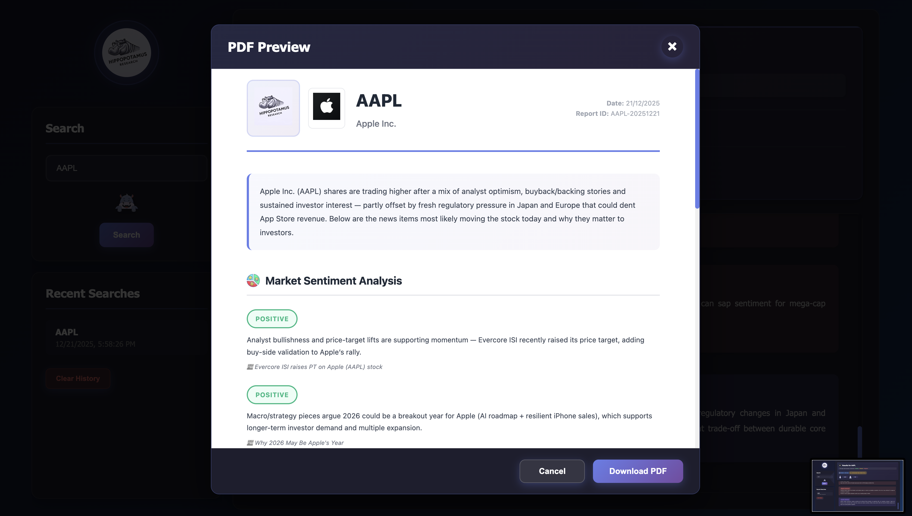

# Stock Ticker Scraping Microservice

A production-ready microservice for scraping AI-generated stock summaries from MarketBeat. Built with Flask, Selenium, and modern web technologies.

## Overview

This microservice provides a RESTful API and web interface for automatically scraping AI-generated stock summaries from MarketBeat. It uses Selenium WebDriver to access MarketBeat, locate AI summary blocks, and provides the content for download. The service follows a privacy-first approach - it stores only audit logs (metadata) and never stores the actual content.

### Screenshots


*Main search interface with ticker input and results display*


*Scraped results with sentiment highlighting and download options*


*PDF preview modal before download*


*Responsive mobile interface*

## Key Features

### Core Functionality
- **RESTful API** - Simple and clear endpoints for scraping operations
- **Web UI** - Modern, responsive web interface with PWA support
- **PDF Generation** - Generate and download PDF reports with preview functionality
- **Ticker Logos** - Automatic display of stock ticker logos in UI and PDFs
- **Structured Data Parsing** - Automatic parsing of text into structured JSON (sentiment items, metadata)
- **Download Options** - Download as JSON, TXT, or both (ZIP)

### Technical Features
- **Error Handling** - Specific HTTP status codes (400, 404, 504, 500)
- **Input Validation** - Ticker symbol validation
- **Rate Limiting** - Built-in rate limiting to prevent abuse
- **Audit Logging** - Comprehensive audit logs with request tracking
- **Caching** - Metadata caching to reduce redundant operations
- **Docker Support** - Easy deployment with containers
- **Flexible Configuration** - Environment variable support
- **PWA Support** - Progressive Web App capabilities for mobile devices

### Privacy & Security
- **Privacy-First** - Server stores only metadata, never content
- **Request Tracking** - Unique request IDs for all operations
- **Audit Trail** - Complete audit logging of all requests

## Project Structure

The project is organized into logical layers:

```
service_scraping/
├── api/                    # API layer - Flask endpoints
│   ├── routes/             # Route handlers
│   │   ├── health.py       # Health check endpoint
│   │   ├── scrape.py       # Scraping endpoints
│   │   └── web.py          # Web UI routes
│   ├── app.py              # Flask application factory
│   └── wsgi.py             # WSGI entry point for production
├── core/                   # Business logic layer
│   └── scraper.py          # Core scraping logic
├── infrastructure/         # Infrastructure components
│   ├── logger.py           # Logging configuration
│   ├── audit_logger.py     # Audit logging
│   ├── cache.py            # Caching system
│   └── load_driver.py      # Selenium driver management
├── service/                 # Service layer
│   └── scrape_handler.py    # Scraping request handler
├── config/                 # Configuration
│   ├── config.yaml         # Configuration file
│   └── config.py           # Configuration loader
├── utils/                  # Utility functions
│   ├── validation.py       # Input validation
│   ├── exceptions.py       # Custom exceptions
│   ├── text_parser.py      # Text parsing utilities
│   └── paths.py            # Path resolution
├── web_ui/                 # Web interface
│   ├── static/             # Static assets
│   │   ├── css/            # Stylesheets
│   │   ├── js/             # JavaScript
│   │   └── *.png           # Images and icons
│   └── templates/          # HTML templates
│       └── index.html      # Main UI template
├── tests/                  # Test suite
├── logs/                   # Log files
├── output/                  # Output directory (optional)
├── Dockerfile              # Docker configuration
├── requirements.txt         # Python dependencies
├── run.py                  # Local development entry point
└── railway.json            # Railway deployment config
```

## Installation

### Prerequisites

- Python 3.9+
- Docker (optional, for containerized deployment)
- Chrome/Chromium (automatically installed in Docker)

### Quick Start

#### Option 1: Docker (Recommended)

```bash
# Build and run with Docker
python3 docker_run.py
```

This will:
- Build the Docker image
- Start the container
- Open your browser automatically

#### Option 2: Local Development

```bash
# Install dependencies
pip install -r requirements.txt

# Run the service
python3 run.py
```

The service will be available at `http://localhost:5001/`

## API Endpoints

### Health Check

```http
GET /health
```

**Response:**
```json
{
  "status": "healthy",
  "service": "scraping",
  "message": "Scraping microservice is running"
}
```

### Scrape by Ticker (POST)

```http
POST /scrape
Content-Type: application/json

{
  "ticker": "AAPL"
}
```

**Response (Success):**
```json
{
  "success": true,
  "ticker": "AAPL",
  "text": "...",
  "text_length": 1234,
  "json_size": 5678,
  "request_id": "abc12345",
  "structured_data": {
    "ticker": "AAPL",
    "company_name": "Apple Inc.",
    "date": "20241117",
    "header": "...",
    "sentiment_items": [
      {
        "sentiment": "Positive",
        "description": "...",
        "article_title": "..."
      }
    ],
    "bottom_line": "...",
    "metadata": {
      "posted_time": "Posted 1h ago",
      "disclaimer": "AI Generated. May Contain Errors."
    }
  }
}
```

### Scrape by Ticker (GET)

```http
GET /scrape/AAPL
```

**Response:** Same as POST endpoint

### Download Endpoints

```http
GET /scrape/<ticker>/download/json    # Download JSON file
GET /scrape/<ticker>/download/txt     # Download TXT file
GET /scrape/<ticker>/download/both    # Download ZIP with both files
```

### Ticker Logo Endpoints

```http
GET /ticker/<ticker>/logo             # Get logo URL
GET /ticker/<ticker>/logo/image       # Proxy endpoint for logo image (CORS-safe)
```

## Web UI Features

The web interface provides a modern, user-friendly experience for scraping and viewing stock data.

### Main Features

- **Search Interface** - Enter ticker symbols to scrape data
- **Results Display** - View scraped content with sentiment highlighting
- **Ticker Logos** - Automatic display of stock logos
- **Download Options** - Download as JSON, TXT, or PDF
- **PDF Preview** - Preview PDF before downloading
- **Search History** - View and reuse recent searches
- **Responsive Design** - Works on desktop and mobile devices
- **PWA Support** - Install as Progressive Web App

### UI Screenshots

<div align="center">


*Main search interface with ticker input*


*Scraped results with sentiment highlighting*


*PDF preview modal before download*


*Responsive mobile interface*

</div>

### PDF Generation

- **Preview Modal** - Preview PDF content before download
- **Direct Download** - No print dialog, direct file download
- **Multi-page Support** - Automatic page breaks for long content
- **Ticker Logo** - Includes ticker logo in PDF header
- **Structured Layout** - Professional formatting with sentiment analysis

## Configuration

Configuration is managed through `config/config.yaml` and can be overridden with environment variables.

### Key Configuration Options

```yaml
selenium:
  wait_timeout: 2
  page_load_timeout: 14
  headless: true

server:
  host: "0.0.0.0"
  port: 5001
  debug: false

scraping:
  base_url_template: "https://www.marketbeat.com/stocks/NASDAQ/{ticker}/news/"
  ticker_logo_url_template: "https://static2.finnhub.io/file/publicdatany/finnhubimage/stock_logo/{ticker}.svg"
```

### Environment Variables

- `SCRAPING_PORT` - Server port (default: 5001)
- `SCRAPING_HOST` - Server host (default: 0.0.0.0)
- `SCRAPING_DEBUG` - Debug mode (default: false)
- `SCRAPING_SAVE_TO_SERVER` - Save files on server (default: false)
- `PYTHONPATH` - Python path (set automatically by run.py)

## Deployment

### Railway

The project includes `railway.json` for Railway deployment:

```json
{
  "build": {
    "builder": "DOCKERFILE",
    "dockerfilePath": "./Dockerfile"
  },
  "deploy": {
    "startCommand": "gunicorn --bind 0.0.0.0:$PORT --workers 2 --timeout 120 --access-logfile - --error-logfile - service_scraping.api.wsgi:application"
  }
}
```

### Docker

```bash
# Build image
docker build -t scraping-service -f Dockerfile .

# Run container
docker run -d \
  -p 5001:5001 \
  -v $(pwd)/output:/app/service_scraping/output \
  -v $(pwd)/logs:/app/service_scraping/logs \
  --name scraping-service \
  scraping-service
```

### Production

For production deployment, use gunicorn:

```bash
gunicorn --bind 0.0.0.0:$PORT \
  --workers 2 \
  --timeout 120 \
  --access-logfile - \
  --error-logfile - \
  service_scraping.api.wsgi:application
```

## Development

### Running Locally

```bash
# Activate virtual environment
source venv/bin/activate  # On Windows: venv\Scripts\activate

# Install dependencies
pip install -r requirements.txt

# Run development server
python3 run.py
```

### Project Structure Guidelines

- **api/** - API endpoints and routing
- **core/** - Business logic (scraping operations)
- **infrastructure/** - Technical components (logging, caching, drivers)
- **service/** - Service layer (request handling)
- **config/** - Configuration management
- **utils/** - Utility functions
- **web_ui/** - Frontend assets and templates

### Adding New Features

1. **API Endpoints** - Add to `api/routes/`
2. **Business Logic** - Add to `core/` or `service/`
3. **Frontend** - Update `web_ui/static/js/app.js` and `web_ui/templates/index.html`
4. **Configuration** - Update `config/config.yaml` and `config/config.py`

## HTTP Status Codes

- **200** - Success
- **400** - Invalid input (InvalidTickerError)
- **404** - Summary not found (SummaryNotFound)
- **504** - Scraping timeout (ScraperTimeout)
- **500** - Internal server error

## Response Headers

All responses include:
- `X-Request-ID` - Unique request identifier
- `X-Request-Duration` - Processing duration (seconds)

## Error Handling

The service uses a custom exception hierarchy:

```
ScrapingError (base)
├── SummaryNotFound → HTTP 404
├── ScraperTimeout → HTTP 504
└── InvalidTickerError → HTTP 400
```

## Testing

```bash
# Run tests
python -m pytest tests/

# Run specific test
python -m pytest tests/test_api.py
```

## Logging

Logs are written to:
- `logs/scraping_service.log` - Application logs
- `logs/scraping_service.json.log` - Structured JSON logs
- `logs/audit.log` - Audit trail (metadata only)

## Privacy & Security

- **No Content Storage** - Server never stores scraped content
- **Metadata Only** - Only request metadata is logged
- **Rate Limiting** - Built-in protection against abuse
- **Request Tracking** - All requests are tracked with unique IDs

## License

[Add your license here]

## Support

For issues, questions, or contributions, please [add your support channels here].

## Changelog

### Recent Updates

- Added PDF preview functionality
- Implemented ticker logo display in UI and PDFs
- Added CORS-safe proxy endpoint for ticker logos
- Improved mobile responsiveness
- Added PWA support
- Enhanced error handling and logging

---

For detailed setup instructions, see [QUICKSTART.md](QUICKSTART.md)
